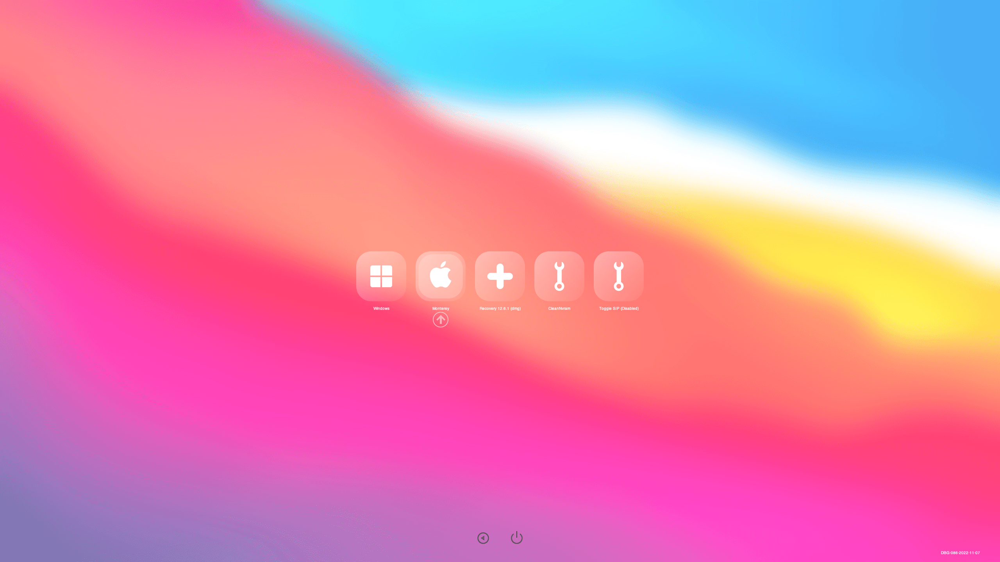

# OpenCore 主题

Themes For OpenCore v0.8.6 and tested.

* Thanks to LuckyCrack for [OpenCore-Themes](https://github.com/LuckyCrack/OpenCore-Themes)
* Thanks to [acidanthera/OcBinaryData](https://github.com/acidanthera/OcBinaryData/)
* Thanks to chris1111 for Icnspack-Builder
* Thanks to OpenCore Team for OpenCore

* 修改自 [LuckyCrack/OpenCore-Themes](https://github.com/LuckyCrack/OpenCore-Themes)

## 安装

### Resource
* 替换 EFI > OC > Resources 文件夹
* 或者
* 将 LuckyCrack 文件夹复制至 EFI > OC > Resources > image 下

### config.list
* Misc > Boot > PickerMode > External
* Misc > Boot > PickerAttributes > 129
* Misc > Boot > PickerVariant: LuckyCrack\BigSur

## BigSur



## Others
* 最偏爱 BigSur 主题, 所以只修改了一个

## 原主题加载报错

```
opencore OCUI: SetDefault width 40px != Selector width 144px
```